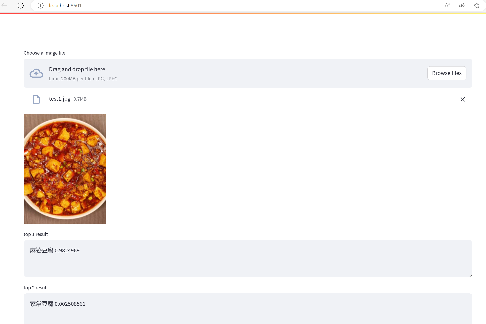

# Chinese ChineseFoodNet Classifcation

This repo trained ChineseFoodNet dataset by VIT. By using the pretrained VIT model, it can easily beats the single resnet152 model (VIT get top1 acc 0.7967 on test data set, ResNet152 get top1 acc 0.7900 on test data set)



If you want to use the model and code, please refer to https://github.com/yaoxiaoyuan/mimix.

```
@misc{mimix,
  title={mimix},
  author={Xiaoyuan Yao},
  year={2021}
}
```

